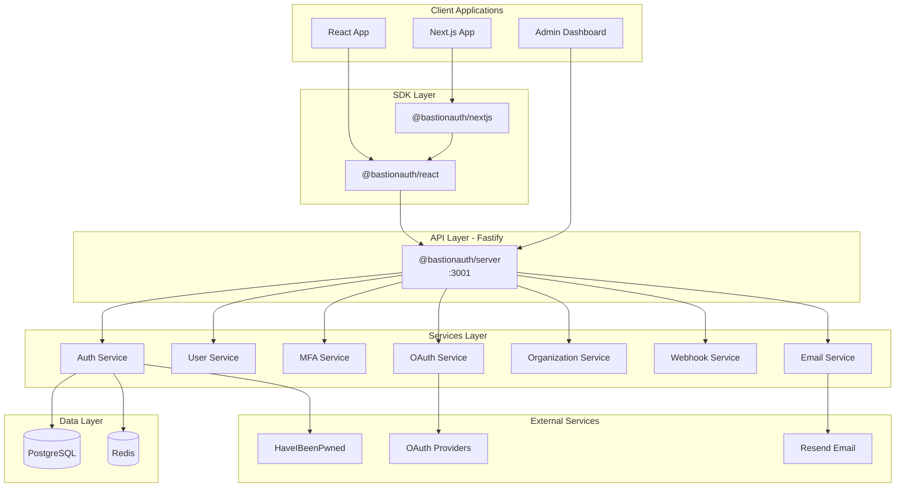
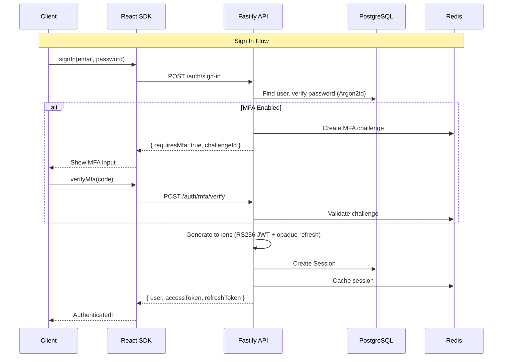

# BastionAuth - Project Overview Documentation

## Overview

BastionAuth is a **complete, self-hostable enterprise authentication system** - essentially a Clerk/Auth0 alternative that you can run on your own infrastructure. The project is structured as a pnpm monorepo using Turborepo for builds.---

## What We Are Building

BastionAuth provides a full-featured authentication solution with:| Feature | Description ||---------|-------------|| **Complete Authentication** | Email/password, OAuth (Google, GitHub, Microsoft, Apple, LinkedIn), magic links, passkeys || **Multi-Factor Authentication** | TOTP (Time-based One-Time Password), backup codes, WebAuthn support || **Organizations & RBAC** | Multi-tenancy with customizable role-based access control || **Enterprise Security** | Argon2id password hashing, RS256 JWT, rate limiting, HaveIBeenPwned breach detection || **Developer Experience** | Beautiful React components, Next.js integration, comprehensive hooks || **Admin Dashboard** | User management, audit logs, webhooks, API keys, session management |---

## Architecture Diagram



---

## Package Structure

### 1. `@bastionauth/core` - [packages/core/](packages/core/)

Shared foundation package containing:

- **Types**: User, Session, Organization, TokenPair, API request/response types
- **Constants**: Error codes, event names, configuration defaults
- **Utilities**: Validation helpers, common functions

### 2. `@bastionauth/server` - [packages/server/](packages/server/)

Fastify-based API server (the heart of BastionAuth):| Component | Location | Purpose ||-----------|----------|---------|| Services | `src/services/` | Business logic (auth, email, MFA, OAuth, org, user, webhook, admin) || Routes | `src/routes/` | API endpoints (auth, users, admin) || Middleware | `src/middleware/` | Rate limiting, authentication, audit logging || Plugins | `src/plugins/` | Prisma, Redis, CORS configuration || Prisma Schema | `src/prisma/schema.prisma` | Complete database schema with 14 models |

### 3. `@bastionauth/react` - [packages/react/](packages/react/)

React SDK providing:| Export | Type | Purpose ||--------|------|---------|| `BastionProvider` | Component | Context provider wrapping your app || `useAuth` | Hook | Access `isSignedIn`, `userId`, `signOut`, `getToken` || `useUser` | Hook | Access current user data || `useSession` | Hook | Access session information || `useOrganization` | Hook | Access active organization || `useSignIn` | Hook | Programmatic sign-in control || `useSignUp` | Hook | Programmatic sign-up control || `SignIn` | Component | Pre-built sign-in UI || `SignUp` | Component | Pre-built sign-up UI || `UserButton` | Component | User avatar with dropdown menu |

### 4. `@bastionauth/nextjs` - [packages/nextjs/](packages/nextjs/)

Next.js integration:

- **`authMiddleware`**: Edge middleware for route protection
- **Server helpers**: `auth()`, `currentUser()` for Server Components
- Re-exports all React SDK components

### 5. `@bastionauth/admin` - [packages/admin/](packages/admin/)

Admin dashboard (Next.js 14 App Router):

- Dashboard overview with statistics
- User management (list, detail, ban/unban)
- Organization management
- Session management
- Audit logs viewer
- Webhook configuration
- API key management

---

## Database Schema

The Prisma schema in [packages/server/src/prisma/schema.prisma](packages/server/src/prisma/schema.prisma) defines:| Model | Purpose ||-------|---------|| `User` | User accounts with profile, MFA settings, metadata || `Session` | Active sessions with device info, refresh token hash || `OAuthAccount` | Linked OAuth provider accounts || `Organization` | Multi-tenant organizations || `OrganizationMembership` | User membership in organizations with roles || `OrganizationRole` | Custom roles with permissions || `OrganizationInvitation` | Pending invitations || `EmailVerificationToken` | Email verification tokens || `PasswordResetToken` | Password reset tokens || `MagicLink` | Magic link authentication tokens || `Passkey` | WebAuthn credentials || `AuditLog` | Security audit trail || `Webhook` | Webhook endpoint configurations || `WebhookDelivery` | Webhook delivery tracking || `ApiKey` | Server-to-server API keys |---

## Authentication Flow



---

## Security Implementation

| Feature | Implementation ||---------|----------------|| **Password Hashing** | Argon2id (64MB memory, 3 iterations, 4 parallelism) || **JWT Signing** | RS256 with 4096-bit keys, 15-minute expiry || **Refresh Tokens** | Opaque tokens, SHA256 hashed storage, 7-day expiry with rotation || **Rate Limiting** | Sliding window via Redis sorted sets || **Breach Detection** | HaveIBeenPwned k-anonymity API || **MFA** | TOTP (RFC 6238) with encrypted secrets, encrypted backup codes || **Encryption** | AES-256-GCM for sensitive data at rest |---

## Current Implementation Status

All major features are **completed**:

- [x] Monorepo setup (pnpm + Turborepo)
- [x] Docker configuration (PostgreSQL + Redis)
- [x] Core package (types, constants, utilities)
- [x] Server package (Fastify API with all services)
- [x] Authentication (sign-up, sign-in, sign-out, refresh, password reset)
- [x] Email verification and magic links
- [x] MFA (TOTP with backup codes)
- [x] OAuth (Google, GitHub, Microsoft, Apple, LinkedIn)
- [x] Organizations with RBAC
- [x] Webhooks with delivery tracking
- [x] Admin API and API keys
- [x] React SDK
- [x] Next.js integration
- [x] Admin dashboard
- [x] Example app
- [x] Unit tests (Vitest)
- [x] E2E tests (Playwright)

---

## Next Steps

### Immediate (Ready for Production)

1. **End-to-end testing** - Run `pnpm dev` and test all flows in browser
2. **Environment configuration** - Set up production `.env` files
3. **Generate production keys** - Run `./scripts/generate-keys.sh`
4. **Database migration** - Run `pnpm db:migrate` in production

### Short-term Enhancements

1. **CI/CD Pipeline** - Set up GitHub Actions for testing, building, and deploying
2. **npm Publishing** - Publish packages to npm registry
3. **Custom email templates** - Allow customization of email content
4. **Documentation site** - Build bastionauth.dev with guides

### Future Roadmap (from ARCHITECTURE.md)

- [ ] SAML SSO support
- [ ] Passwordless authentication (email-only, no password)
- [ ] User impersonation (admin feature)
- [ ] IP allowlisting
- [ ] Session fingerprinting
- [ ] Audit log export
- [ ] Kubernetes Helm chart

---

## Quick Start Commands

```bash
# Install dependencies
pnpm install

# Start Docker (PostgreSQL + Redis)
pnpm docker:up

# Generate Prisma client
pnpm db:generate

# Run database migrations
pnpm db:migrate

# Start all services in development
pnpm dev

# Run tests
pnpm test

# Build all packages
pnpm build
```

---

## Key Files Reference