# BastionAuth - Enterprise Authentication System

## Architecture Overview

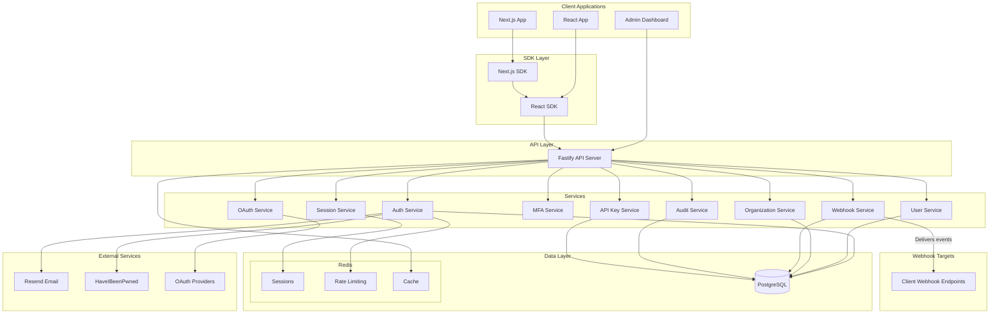


## JWT Authentication Flow

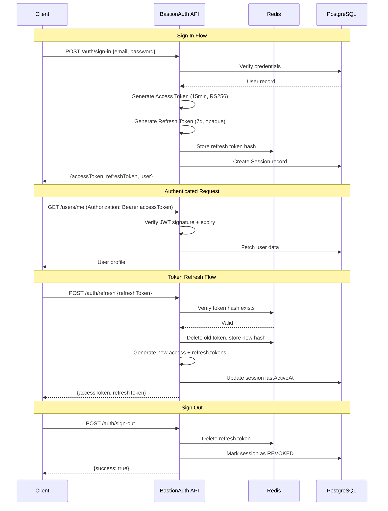


## Webhook Delivery Flow

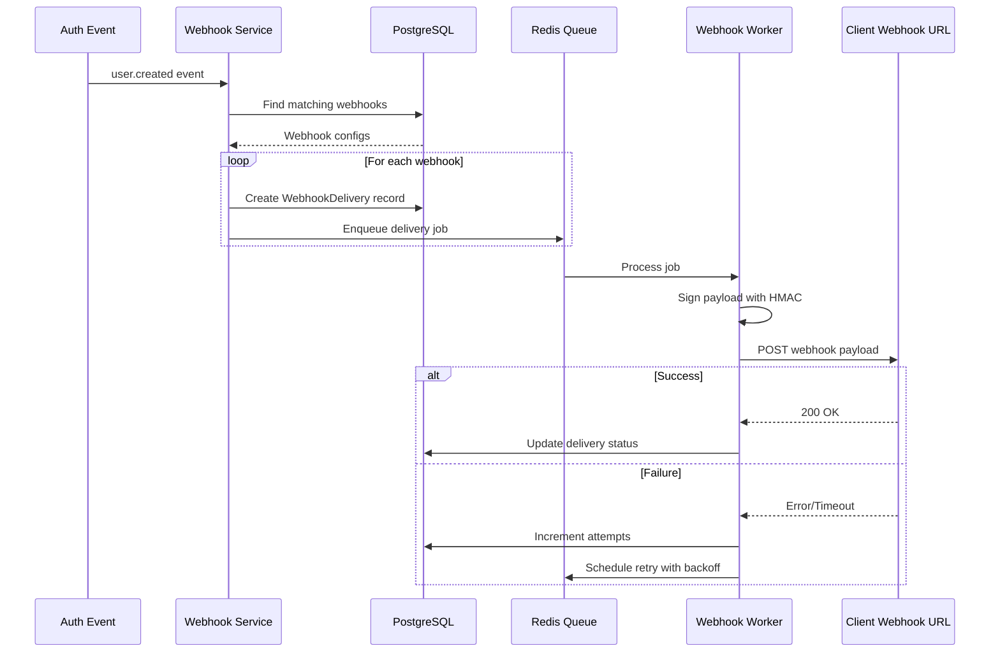


## Implementation Phases

### Phase 1: Monorepo Foundation

- Initialize pnpm workspace with Turborepo
- Configure TypeScript, ESLint, Prettier
- Set up shared `@bastionauth/core` package with types, constants, and utilities
- Docker compose for PostgreSQL and Redis

### Phase 2: Server Package (Primary Focus)

- Fastify application with plugins (Prisma, Redis, CORS, Rate Limiting)
- Complete Prisma schema with all models
- Authentication services (sign-up, sign-in, sign-out, refresh tokens)
- Password hashing with Argon2id, JWT with RS256
- Email verification, password reset, magic links
- MFA with TOTP and backup codes
- OAuth integration (Google, GitHub, Microsoft, Apple, LinkedIn)
- Organization management with RBAC
- Session management with device fingerprinting
- Webhook system with delivery tracking
- Audit logging
- Admin API endpoints

### Phase 3: React SDK

- BastionProvider context with auth state management
- Hooks: useAuth, useUser, useSession, useOrganization, useSignIn, useSignUp
- Components using @mawtech/glass-ui: SignIn, SignUp, UserButton, UserProfile, OrganizationSwitcher, MFASetup
- API client with token refresh interceptor

### Phase 4: Next.js Integration

- Edge middleware helper for route protection
- Server-side helpers: auth(), currentUser()
- Client re-exports

### Phase 5: Admin Dashboard

- Next.js 14 App Router application
- Dashboard overview with statistics
- User management (list, detail, ban/unban, impersonate)
- Organization management
- Session management
- Audit logs viewer
- Webhook configuration
- API key management

### Phase 6: Example App & Documentation

- Example Next.js integration app
- API documentation (OpenAPI spec)
- Getting started guide
- Self-hosting guide

### Phase 7: Testing

- Vitest unit tests for services
- Playwright E2E tests for auth flows

---

## Key Files Structure

```javascript
bastionauth/
├── packages/
│   ├── core/                    # Shared types and utilities
│   ├── server/                  # Fastify API (PRIMARY)
│   ├── react/                   # React SDK
│   ├── nextjs/                  # Next.js utilities
│   └── admin/                   # Admin dashboard
├── apps/
│   └── example-nextjs/          # Example integration
├── docker/
│   └── docker-compose.yml       # PostgreSQL + Redis
├── turbo.json
├── pnpm-workspace.yaml
└── .env.example
```


## Security Implementation

| Feature | Implementation ||---------|----------------|| Password Hashing | Argon2id (64MB memory, 3 iterations) || JWT Signing | RS256 with 15-min access tokens || Refresh Tokens | Opaque tokens, hashed storage, 7-day expiry || Rate Limiting | Sliding window via Redis sorted sets || Breach Detection | HaveIBeenPwned k-anonymity API || MFA | TOTP (RFC 6238) + encrypted backup codes || Encryption | AES-256-GCM for sensitive data at rest || CSRF | Double-submit cookie pattern |

## Estimated Implementation Order

Since you want server-first, I will build in this sequence:

1. **Monorepo setup** - Foundation files, configs, Docker
2. **Core package** - Types, constants, validation utilities
3. **Server package** - Complete API with all endpoints
4. **React SDK** - Provider, hooks, components
5. **Next.js package** - Middleware and server helpers
6. **Admin dashboard** - Full management UI
7. **Example app** - Integration demonstration
8. **Tests** - Unit and E2E coverage

---

## Detailed Authentication Flows

### Email/Password Sign In Flow

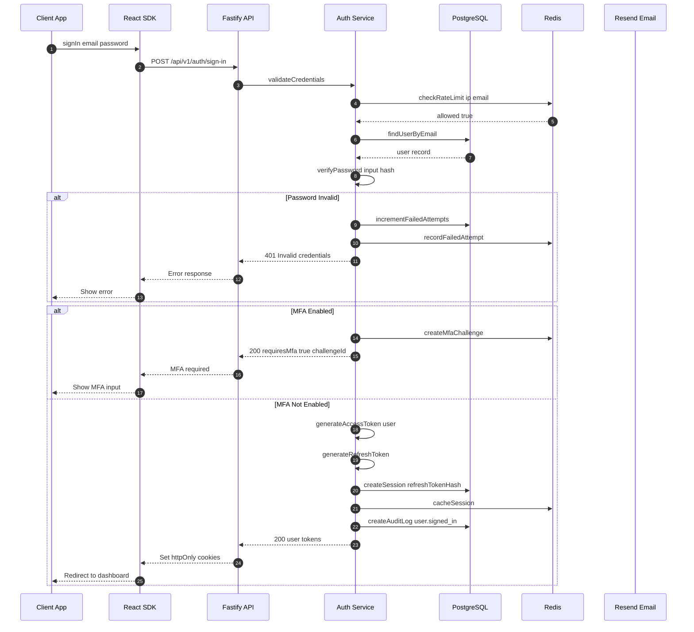


### MFA Verification Flow

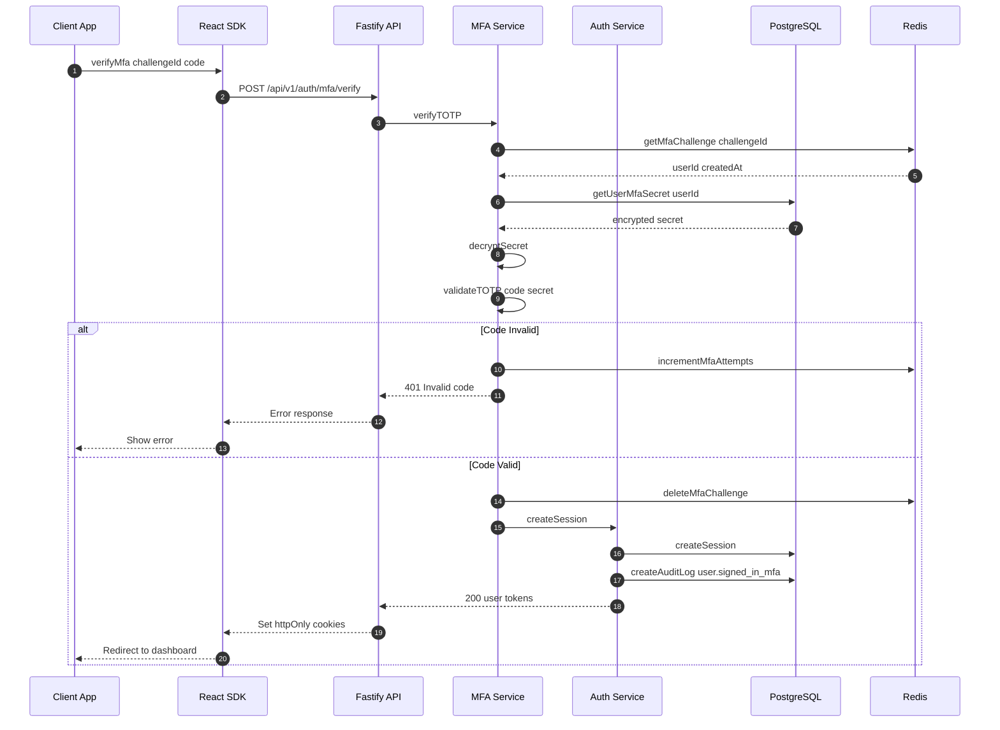


### Token Refresh Flow

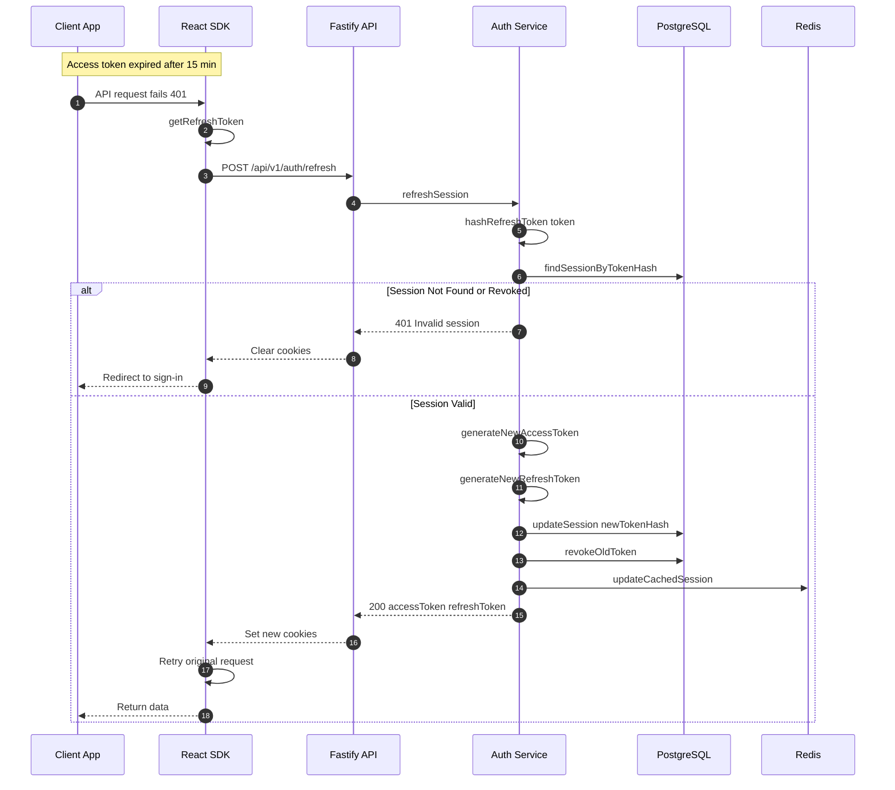


### OAuth Flow - Google Example

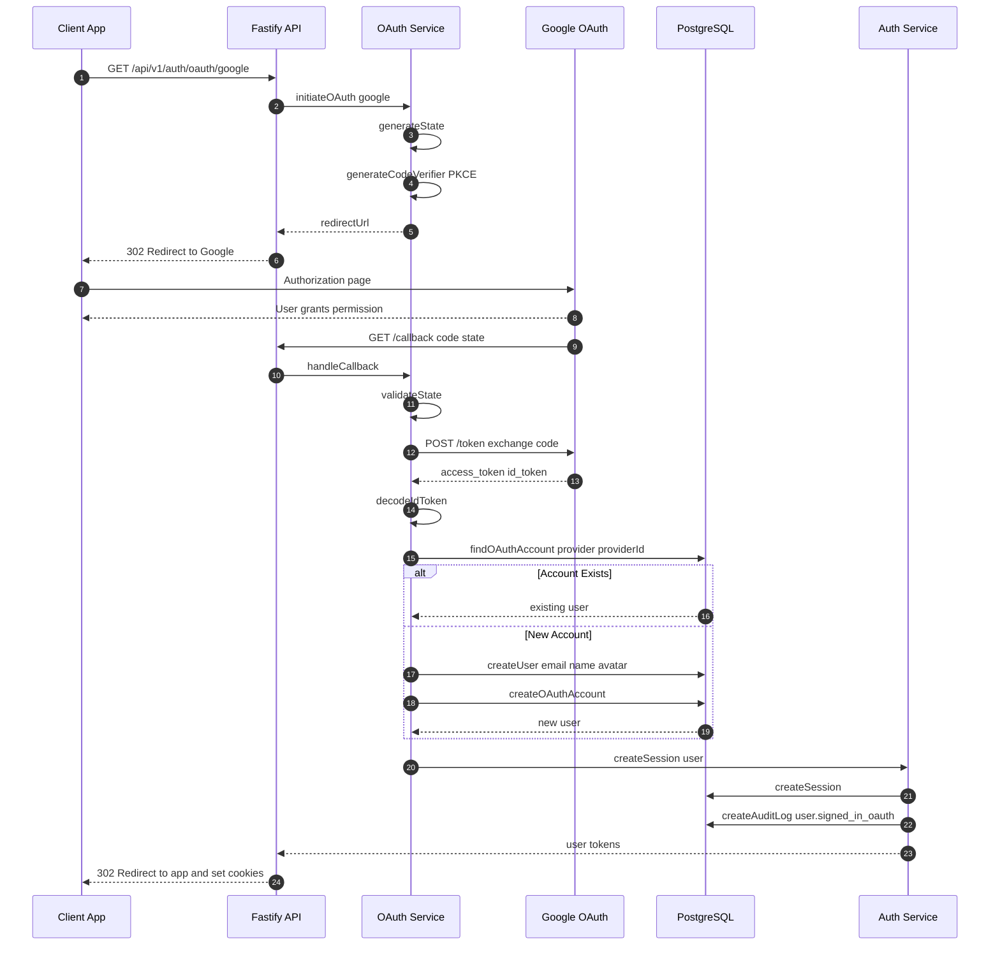


### Password Reset Flow

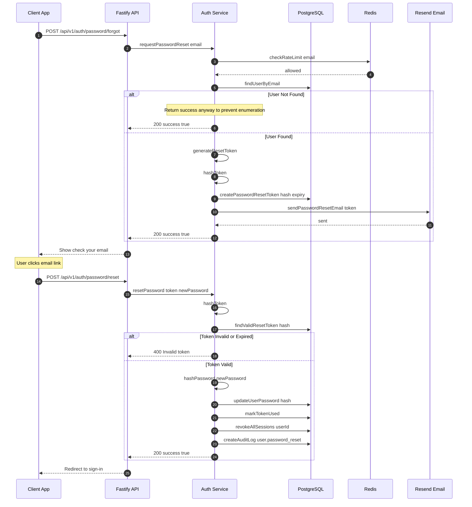

---

## Database Entity Relationship Diagram

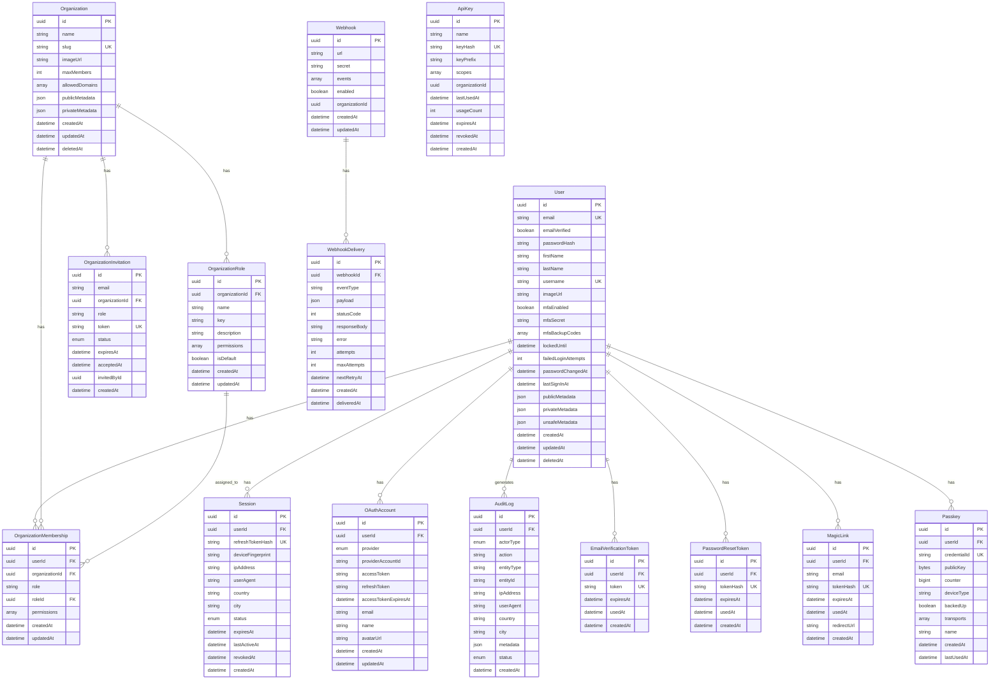

---

## Session and Token Architecture

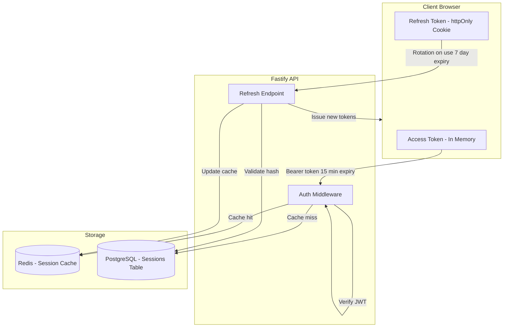

---

## Rate Limiting Architecture

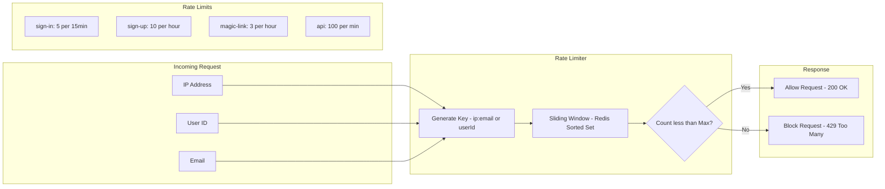

---

## Webhook Delivery System

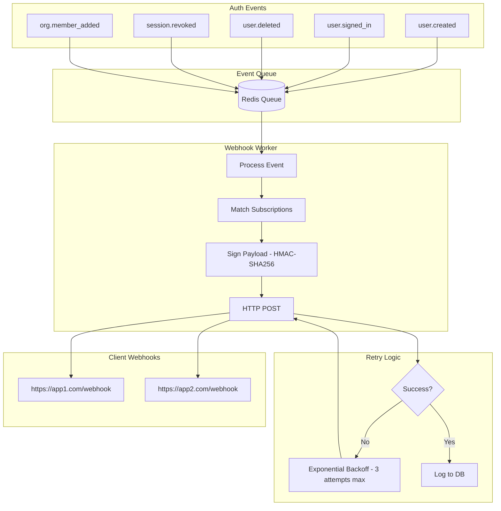

---

## Multi-Tenancy Model

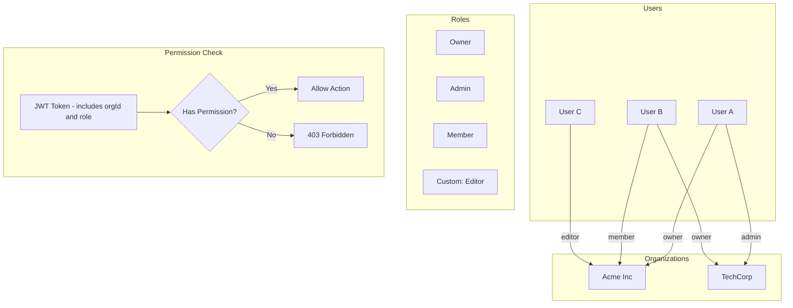

---

## Usage Notes

These diagrams are written in **Mermaid** format and can be rendered in:

- GitHub README files
- GitBook / Docusaurus documentation
- Notion
- VS Code with Mermaid extension
- https://mermaid.live for quick preview

For the **bastionauth.dev** documentation site, these diagrams provide: