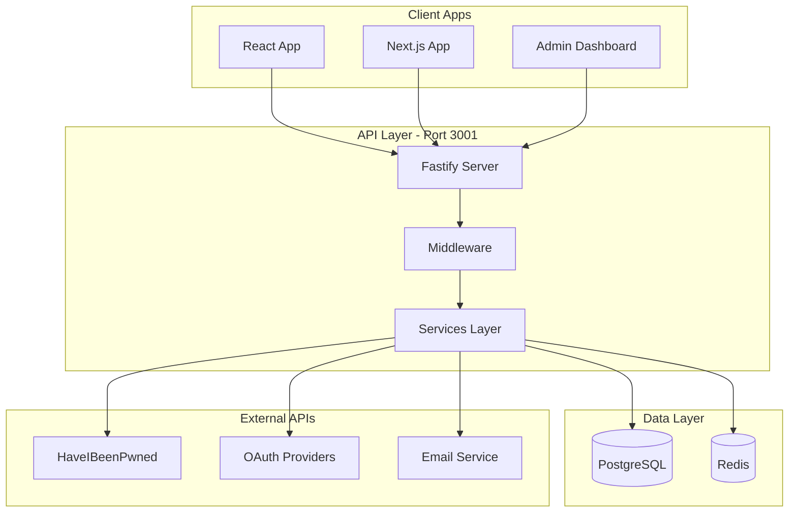
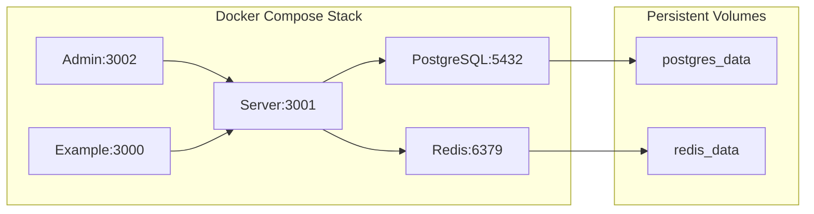
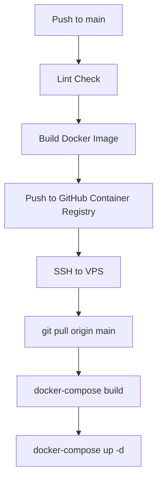
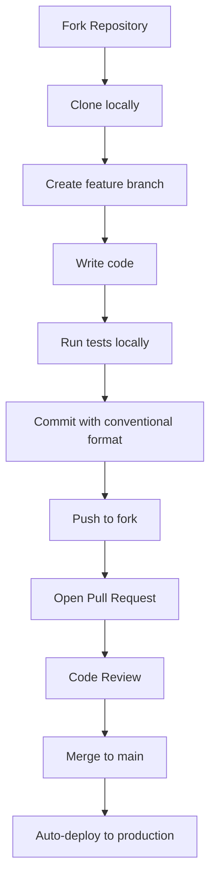

# Master Onboarding Document for BastionAuth

## Document Structure

I will create a single comprehensive markdown file at `docs/ONBOARDING.md` that covers all four perspectives in a junior-developer-friendly way.---

## Section 1: Architecture (Principal Engineer Perspective)

### Why This Stack?

**BastionAuth Services:**

- **Fastify** (not Express): 2x faster, built-in validation, better TypeScript support
- **Monorepo with Turborepo**: Shared code between packages, faster builds with caching
- **Package breakdown**:
- `@bastionauth/core` - Shared types, constants, validation (used by all)
- `@bastionauth/server` - API backend (Fastify + Prisma)
- `@bastionauth/react` - React hooks and components for frontend
- `@bastionauth/nextjs` - Next.js-specific middleware and helpers
- `@bastionauth/admin` - Admin dashboard (Next.js 14)

**PostgreSQL (not MongoDB):**

- ACID compliance for financial-grade auth data
- Relational model fits user-organization-membership hierarchy
- Prisma ORM provides type-safe queries

**Redis (not just PostgreSQL):**

- Sessions: Fast read/write for token validation
- Rate limiting: Sliding window counters
- Caching: Reduce database load

### Data Flow Diagram




### Scalability Design

- **Stateless API**: No server-side sessions - JWT tokens allow horizontal scaling
- **Connection pooling**: Prisma manages PostgreSQL connections
- **Redis clustering**: Can scale Redis horizontally when needed

---

## Section 2: Infrastructure (DevOps Perspective)

### Docker Setup - Step by Step

**File: [`docker/docker-compose.prod.yml`](docker/docker-compose.prod.yml)**



**What each container does:**

1. `postgres` - Database (waits for healthy before server starts)
2. `redis` - Cache/sessions (waits for healthy before server starts)
3. `server` - API on port 3001 (depends on postgres + redis)
4. `admin` - Admin dashboard on port 3002 (depends on server)
5. `example` - Demo app on port 3000 (depends on server)

### CI/CD Pipeline - Step by Step

**File: [`.github/workflows/ci.yml`](.github/workflows/ci.yml)**



**Pipeline stages explained:**

1. **Lint** (29s): Runs ESLint on all packages
2. **Build** (2m 55s): Creates Docker image, pushes to GHCR
3. **Deploy** (3s): SSHs into VPS, pulls code, rebuilds containers

### Environment Variables

Key secrets needed in GitHub:

- `VPS_HOST`, `VPS_USER`, `VPS_SSH_KEY`, `VPS_PORT` - For SSH deployment
- `JWT_PRIVATE_KEY`, `JWT_PUBLIC_KEY` - RSA keys for token signing
- `ENCRYPTION_KEY` - 64-character hex for AES-256
- `CSRF_SECRET` - Random string for CSRF protection

---

## Section 3: Quality Assurance (QA Perspective)

### Local Testing Guide

**Unit Tests** (Vitest):

```bash
pnpm test              # Run all unit tests
pnpm test:watch        # Watch mode for development
pnpm test:coverage     # Generate coverage report
```

**E2E Tests** (Playwright):

```bash
pnpm test:e2e          # Run all E2E tests
pnpm test:e2e:ui       # Visual test runner
```

**Load Tests** (k6):

```bash
k6 run tests/load/auth-load.js  # Authentication load test
```


### Test File Locations

| Type | Location | Framework ||------|----------|-----------|| Unit (core) | `packages/core/tests/` | Vitest || Unit (server) | `packages/server/tests/` | Vitest || E2E | `e2e/` | Playwright || API Contract | `e2e/api/` | Playwright || Load | `tests/load/` | k6 |

### Pipeline Safeguards

1. **Lint gate**: Code must pass ESLint before build
2. **Docker health checks**: Containers must be healthy before dependent services start
3. **SSH deployment**: Only runs on `main` branch pushes

### Testing Strategy Diagram

```mermaid
pyramid
    title Test Pyramid
    "E2E Tests" : 10
    "Integration Tests" : 30
    "Unit Tests" : 60
```

---

## Section 4: Workflow (Team Lead/PM Perspective)

### Definition of Done

A feature is "done" when:

1. Code passes lint (`pnpm lint`)
2. Unit tests pass (`pnpm test`)
3. E2E tests pass (if applicable)
4. PR reviewed and approved
5. Documentation updated (if user-facing)
6. Merged to `main` and deployed

### Contribution Workflow

Based on [`CONTRIBUTING.md`](CONTRIBUTING.md):




### Branch Naming Convention

- `feature/` - New features (e.g., `feature/passkey-support`)
- `fix/` - Bug fixes (e.g., `fix/session-expiry-bug`)
- `docs/` - Documentation (e.g., `docs/api-reference`)
- `refactor/` - Code cleanup
- `test/` - Adding tests

### Commit Message Format

```javascript
<type>(<scope>): <description>

Example: feat(auth): add passkey authentication support
```


### Project Goals

BastionAuth aims to be:

1. **Security-first**: Enterprise-grade authentication
2. **Self-hostable**: Run anywhere with Docker
3. **Developer-friendly**: Great SDKs and documentation
4. **Scalable**: Stateless architecture for horizontal scaling

---

## Implementation Details

The document will be approximately 500-700 lines and include:

- ASCII diagrams converted to Mermaid for better rendering