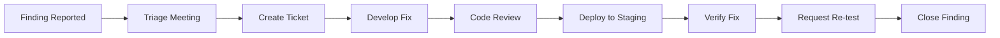

# BastionAuth - Professional Penetration Testing Schedule

This document outlines the process for scheduling and executing professional penetration testing before production deployment.

## Executive Summary

Professional penetration testing is **required** before:
- Initial production launch
- Major feature releases affecting authentication
- Annual security compliance audits

## Penetration Testing Timeline

### Pre-Production Release Schedule

| Phase | Timeline | Activities |
|-------|----------|------------|
| **Preparation** | T-6 weeks | Scope definition, vendor selection |
| **Vendor Engagement** | T-5 weeks | Sign NDA, provide access details |
| **Testing Window** | T-4 to T-2 weeks | Active penetration testing |
| **Report Delivery** | T-2 weeks | Receive findings report |
| **Remediation** | T-2 to T-1 weeks | Fix critical/high findings |
| **Re-test** | T-1 week | Verify fixes |
| **Go/No-Go** | T-0 | Production deployment decision |

### Ongoing Schedule

| Frequency | Scope | Trigger |
|-----------|-------|---------|
| **Annual** | Full application pentest | Compliance requirement |
| **Quarterly** | Automated vulnerability scan | Standard practice |
| **Per Release** | Targeted testing of changes | Major auth changes |
| **Ad-hoc** | Incident response | Security incident |

## Scope Definition

### In-Scope Components

#### API Server (Primary Target)

| Component | Priority | Endpoints |
|-----------|----------|-----------|
| Authentication | Critical | `/api/v1/auth/*` |
| Session Management | Critical | Token handling, refresh |
| MFA | High | `/api/v1/auth/mfa/*` |
| Admin API | High | `/api/v1/admin/*` |
| User Management | High | `/api/v1/users/*` |
| Organizations | Medium | `/api/v1/organizations/*` |
| OAuth | Medium | `/api/v1/auth/oauth/*` |
| Webhooks | Medium | `/api/v1/webhooks/*` |

#### Frontend Applications

| Component | Priority | URL |
|-----------|----------|-----|
| Example Next.js App | Medium | `http://app.bastionauth.dev` |
| Admin Dashboard | High | `http://admin.bastionauth.dev` |
| React SDK | Low | N/A (code review) |

#### Infrastructure

| Component | Priority | Notes |
|-----------|----------|-------|
| PostgreSQL | High | Connection security, data protection |
| Redis | High | Session storage security |
| Email Service | Medium | Integration security |
| Network | Medium | TLS, firewall rules |

### Out-of-Scope

- Third-party OAuth providers (Google, GitHub, etc.)
- Third-party email service (Resend) internal systems
- DDoS testing (coordinate separately)
- Social engineering

## Testing Methodologies

### Required Testing Types

1. **Authentication Testing**
   - Password brute force protection
   - Account lockout bypass
   - Session fixation
   - Session hijacking
   - Token manipulation
   - OAuth flow vulnerabilities

2. **Authorization Testing**
   - Privilege escalation (horizontal & vertical)
   - IDOR (Insecure Direct Object References)
   - Admin function access controls
   - Organization boundary enforcement

3. **Input Validation**
   - SQL Injection
   - Cross-Site Scripting (XSS)
   - Command Injection
   - Path Traversal
   - LDAP Injection

4. **Business Logic**
   - Account enumeration
   - Password reset flaws
   - MFA bypass
   - Rate limit bypass
   - Race conditions

5. **API Security**
   - Broken authentication
   - Broken authorization
   - Mass assignment
   - Security misconfiguration
   - Insufficient logging

6. **Cryptography**
   - Weak algorithms
   - Key management
   - Token generation
   - Password hashing

## Vendor Selection

### Recommended Penetration Testing Firms

| Vendor | Specialization | Website |
|--------|----------------|---------|
| Bishop Fox | Enterprise applications | bishopfox.com |
| Synack | Crowdsourced testing | synack.com |
| NCC Group | Authentication systems | nccgroup.com |
| Cobalt | SaaS applications | cobalt.io |
| Bugcrowd | Bug bounty + pentest | bugcrowd.com |
| Rapid7 | Comprehensive testing | rapid7.com |

### Selection Criteria

| Criteria | Weight | Notes |
|----------|--------|-------|
| Authentication expertise | 30% | Must have auth system experience |
| Compliance certifications | 20% | SOC 2, PCI-DSS experience |
| Report quality | 20% | Sample reports reviewed |
| Availability | 15% | Can meet timeline |
| Cost | 15% | Within budget |

### Required Vendor Qualifications

- [ ] CREST/OSCP certified testers
- [ ] Demonstrated authentication testing experience
- [ ] SOC 2 Type II compliant operations
- [ ] Professional liability insurance
- [ ] Signed NDA
- [ ] Clear rules of engagement

## Preparation Checklist

### 4 Weeks Before Testing

- [ ] **Environment Setup**
  - [ ] Staging environment identical to production
  - [ ] Separate database with realistic (anonymized) data
  - [ ] All services deployed and operational
  - [ ] Logging enabled for test activity

- [ ] **Access Provisioning**
  - [ ] Test accounts created:
    - Regular user account
    - Admin account
    - MFA-enabled account
    - Banned/locked account
  - [ ] API keys generated
  - [ ] Network access configured (if testing from external)

- [ ] **Documentation Prepared**
  - [ ] Architecture diagrams
  - [ ] API documentation
  - [ ] Authentication flow documentation
  - [ ] Technology stack details
  - [ ] Previous security reports (if any)

### 1 Week Before Testing

- [ ] **Kickoff Meeting Scheduled**
  - [ ] Technical walkthrough of application
  - [ ] Scope confirmation
  - [ ] Emergency contacts established
  - [ ] Communication channels set up (Slack/Teams)

- [ ] **Monitoring Prepared**
  - [ ] Alert thresholds adjusted
  - [ ] Testing IP addresses whitelisted
  - [ ] On-call personnel notified
  - [ ] Backup tested

## Rules of Engagement

### Authorized Activities

| Activity | Allowed | Notes |
|----------|---------|-------|
| Automated scanning | ✅ | During agreed hours |
| Manual exploitation | ✅ | Non-destructive |
| Password attacks | ✅ | Against test accounts |
| Session manipulation | ✅ | Own sessions only |
| API fuzzing | ✅ | Rate limited |
| Data access | ✅ | Read test data only |

### Prohibited Activities

| Activity | Reason |
|----------|--------|
| DDoS attacks | Causes service disruption |
| Data destruction | Permanent damage |
| Production testing | Unless explicitly approved |
| Social engineering | Out of scope |
| Physical access | Out of scope |
| Testing other tenants | Boundary violation |

### Emergency Procedures

```
CRITICAL FINDING DISCOVERED:
1. Stop testing immediately
2. Contact security lead within 1 hour
3. Document finding with screenshots
4. Do not attempt further exploitation
5. Await further instructions

CONTACTS:
- Security Lead: [NAME] - [PHONE] - [EMAIL]
- On-Call Engineer: [PHONE]
- PagerDuty: [INTEGRATION]
```

## Severity Classification

| Severity | CVSS Score | Response SLA | Examples |
|----------|------------|--------------|----------|
| **Critical** | 9.0-10.0 | 24 hours | Auth bypass, RCE, data breach |
| **High** | 7.0-8.9 | 72 hours | SQL injection, privilege escalation |
| **Medium** | 4.0-6.9 | 2 weeks | XSS, CSRF, information disclosure |
| **Low** | 0.1-3.9 | 1 month | Missing headers, verbose errors |
| **Info** | 0 | Backlog | Best practice recommendations |

## Remediation Process

### Critical/High Findings



### Tracking Template

| Finding ID | Severity | Description | Status | Owner | Due Date |
|------------|----------|-------------|--------|-------|----------|
| PEN-001 | Critical | Auth bypass via... | In Progress | @dev1 | T-10 days |
| PEN-002 | High | SQL injection in... | Fixed | @dev2 | T-8 days |

## Reporting Requirements

### Required Report Sections

1. **Executive Summary**
   - Overall security posture
   - Critical risk areas
   - Recommendations

2. **Technical Findings**
   - Detailed vulnerability descriptions
   - Steps to reproduce
   - Evidence (screenshots, logs)
   - CVSS scoring
   - Remediation guidance

3. **Methodology**
   - Tools used
   - Testing timeline
   - Coverage metrics

4. **Appendices**
   - Raw scan results
   - Testing logs
   - Detailed remediation guides

### Deliverables Timeline

| Deliverable | Due Date | Format |
|-------------|----------|--------|
| Draft Report | T+2 days after testing | PDF |
| Technical Debrief | T+3 days | Meeting |
| Final Report | T+5 days | PDF |
| Re-test Report | T+7 days after fixes | PDF |

## Budget Considerations

### Cost Estimates (2024)

| Scope | Duration | Estimated Cost |
|-------|----------|----------------|
| API Pentest (Basic) | 1 week | $8,000 - $15,000 |
| Full Application | 2 weeks | $20,000 - $40,000 |
| Comprehensive + Retest | 3 weeks | $35,000 - $60,000 |
| Bug Bounty Program | Ongoing | $5,000 - $20,000/month |

### Budget Line Items

```
Penetration Testing Budget:
- Professional pentest (annual): $30,000
- Quarterly vulnerability scans: $4,000
- Bug bounty program: $24,000/year
- Security tools/training: $5,000
- Contingency (20%): $12,600
────────────────────────────────
Total Annual Security Testing: $75,600
```

## Sign-Off Requirements

### Before Production Launch

| Requirement | Responsible | Sign-off |
|-------------|-------------|----------|
| All Critical findings remediated | Engineering | [ ] |
| All High findings remediated | Engineering | [ ] |
| Medium findings tracked | Security | [ ] |
| Re-test passed | Vendor | [ ] |
| Report archived | Security | [ ] |
| Risk acceptance (if any) | CTO | [ ] |

### Approval Signatures

```
_______________________________  _______________
Security Lead                    Date

_______________________________  _______________
Engineering Lead                 Date

_______________________________  _______________
CTO / Product Owner              Date
```

## Post-Pentest Actions

### Immediate (Week 1)
- [ ] Distribute report to stakeholders
- [ ] Create JIRA tickets for all findings
- [ ] Assign owners to critical/high issues
- [ ] Begin remediation sprint

### Short-term (Month 1)
- [ ] Complete critical/high remediation
- [ ] Schedule re-test
- [ ] Update security documentation
- [ ] Conduct lessons learned session

### Long-term (Quarter 1)
- [ ] Address medium findings
- [ ] Implement recommended improvements
- [ ] Update security policies
- [ ] Plan next assessment

## Contact Information

### Internal Security Team

| Role | Name | Email | Phone |
|------|------|-------|-------|
| Security Lead | TBD | security@bastionauth.dev | - |
| Engineering Lead | TBD | eng@bastionauth.dev | - |
| On-Call | - | oncall@bastionauth.dev | - |

### External Resources

| Resource | Contact |
|----------|---------|
| Pentest Vendor | [Vendor Contact] |
| Legal Counsel | [Legal Contact] |
| Cyber Insurance | [Insurance Contact] |

---

**Document Owner:** Security Team  
**Last Updated:** December 2024  
**Review Frequency:** Before each pentest engagement

